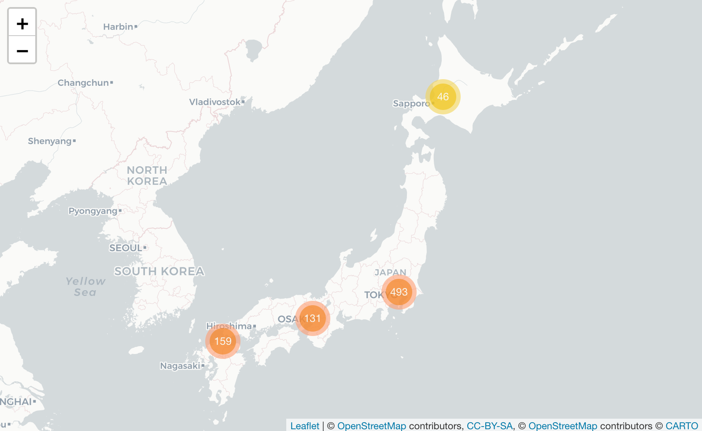
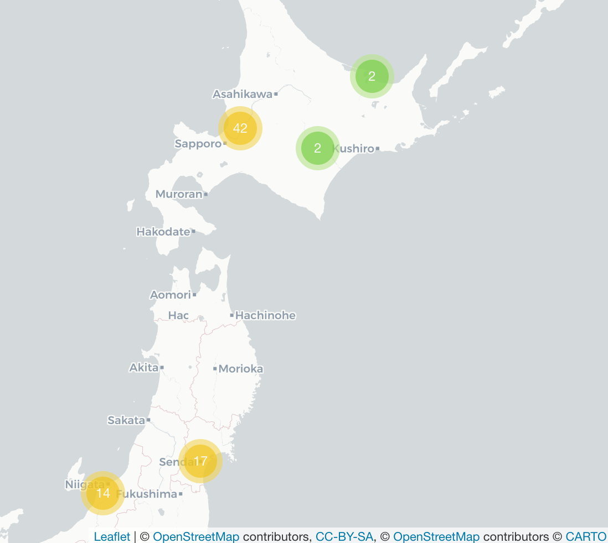
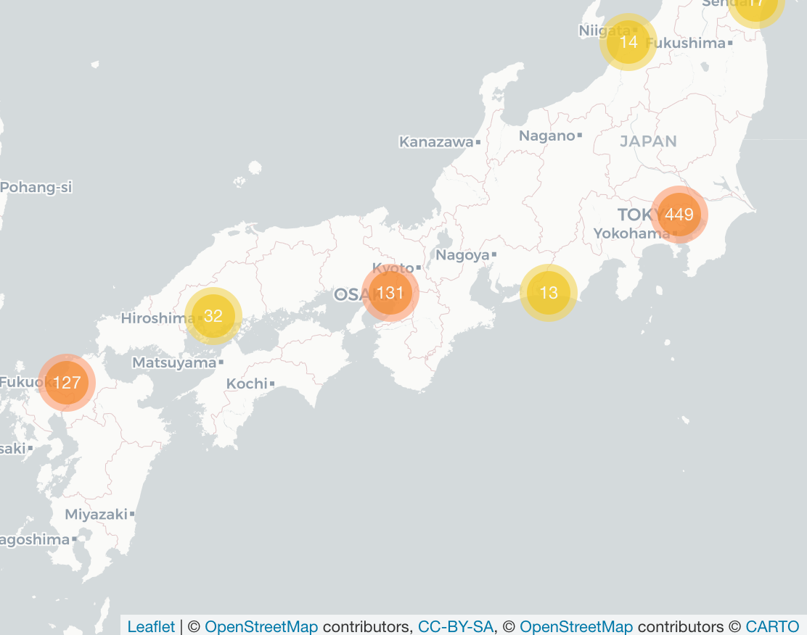

```{r setup, include=FALSE}
knitr::opts_chunk$set(
	echo = TRUE,
	message = FALSE,
	warning = FALSE
)
```
# Introduction

Running a thriving local restaurant is not always as charming as first impressions appear. There are often all sorts of unexpected troubles popping up that could hurt business. One common predicament is that restaurants need to know how many customers to expect each day to effectively purchase ingredients and schedule staff members. This forecast is not easy to make because many unpredictable factors affect restaurant attendance, like weather and local competition. It is even harder for newer restaurants with little historical data.
In this task, you are challenged to use reservation and visitation data to predict the total number of visitors to a restaurant for future dates. This information will help restaurants be much more efficient and allow them to focus on creating an enjoyable dining experience for their customers.

## Problem Statement

In this task, we are challenged to use reservation and visitation data to predict the total number of visitors to a restaurant for future dates.


 We have a certain amount of information about these restaurants like reservations, dates with the number of customers and reservations , the location of the restaurant etc... 
 
 Our main objective will be to create different model that we will use to predict, (i.e. linear, decision tree and random forest model), and choose the model that seems the best one.

\newpage

# Setup the software  

The software used for the development of the study and the writing of the report is R[1]. The first step is to load the libraries using during the development of the report: tidyverse[2], lubridate[3], leaflet[4], tidymodels[5], rpart[6], rpart.plot[7], caTools [8], RMySQL[9] and mapdata[10].

## Load relevant packages for analysis

```{r}
library(tidyverse)
library(lubridate)
library(leaflet)
library(tidymodels)
library(rpart)
library(rpart.plot)
library(caTools)
library(RMySQL)
library(mapdata)
```
 
\newpage 
 
# Analysis

## Importing data from MySQL Workbench 8.0 CE

Before being able to deal with the data set in Rstudio in order to perform an exploratory data analysis and try to find the correct prediction method, the data must be correctly extracted from the mySQL database. For this purpose the “RMySQL” package is used, with which it is possible to implement queries in RStudio. 

All the following command will be just shown and not run in the chunk of report, they were used in a separate file. We will report them here to let you know how we import the table of the database in Rstudio.

First we connect Rstudio to our database through the use of the command **dbConnect**

mydb <- dbConnect(
  MySQL(), 
  user="newuser",
  password="will-20",
  dbname="ITDAproject",
  host="127.0.0.1"
)

dbListTables(mydb) #will return the different names of the table in the database

Now we will crate data frames in R, by extracting the tables from the database, it will be done by writing down some queries through the use of the command **dbGetQuery**. 

- Creation of *air_reserve*, it consist in the left join between the tables air_reserve and restaurant_info 

air_reserve <- dbGetQuery(mydb, 
"
SELECT R.*, RI.*
FROM air_reserve R left JOIN restaurant_info RI USING(ID);
")

- Creation of *air_visit*, it consist in the left join between the tables air_visit and restaurant_info 


air_visit <- dbGetQuery(mydb, 
                        "
SELECT V.*, RI.*
FROM air_visit V left JOIN restaurant_info RI USING(ID);
")

- Creation of *date_info*, creation of a data frame with the information present in date_info table

date_info <- dbGetQuery(mydb, 
                        "
SELECT * 
FROM date_info;
")

- Creation of *restaurant_info*, creation of a data frame with the information present in restaurant_info table

restaurant_info <- dbGetQuery(mydb, 
                              "
SELECT * 
FROM restaurant_info;
")


dbDisconnect(mydb) # It's polite to let the database know when you're done

- We ran the command **glimpse** to take a look to how many observations(rows) we have in each data frames and how many variables(columns)  we have for each data frames.  

glimpse(air_reserve)
glimpse(air_visit)
glimpse(date_info)
glimpse(restaurant_info)

- The last step done consist in convert the data frames in csv files that we will use in the rest of the analysis

write.csv(air_reserve,"reservation_data.csv")
write.csv(air_visit,"visit_data.csv")
write.csv(date_info,"date_info.csv")
write.csv(restaurant_info,"restaurant_info.csv")
\newpage
## **Step 1 - read in the dataset**

```{r}
reservations <- read.csv("reservation_data.csv")
visits <- read.csv("visit_data.csv")
date_info <- read.csv("date_info.csv")
restaurant_info <- read.csv("restaurant_info.csv")

```

All the relevant data is read in - we started from a point where we ran SQL queries to get the restaurant information into the reservations and visits tables but need to do some variable manipulation to align the dates to get the date information to a point where we can join as some data sets store the date in different ways. For this we will use the **lubridate** package in R.


## **Step2- Take a look on the variable in the data set**

In this part we will become aware of the different data set we have at our disposal :

-  **Variable in reservations** 

``` {r names res, eval= FALSE}
names(reservations)
```

- ID: id of the restaurant  

- reserve_datetime: the date and time the reservation was made  

- visit_datetime: the date and time of the reservation  

- reserve_visitors: the number of visitors for that reservation  

We will explain the meaning of the other variable in the section of restaurant_info, cause they are the result of the left join used before.

-  **Variable in reservations**

``` {r names visits, eval= FALSE}
names(visits)
```

- ID: id of the restaurant  

- visit_date: the date of the visit  

- visitors: the number of visitors to the restaurant on the date 

We will explain the meaning of the other variable in the section of restaurant_info, cause they are the result of the left join used before.

-  **Variable in date_info**

``` {r names date_info, eval= FALSE}
names(date_info)
```

- calendar_date: represent the date in the format year-month-day  

- day_of_week: represent the day of the week in label  

- holiday_flg: it tell us if the calendar date is a holiday day in Japan


-  **Variable in restaurant_info** 

``` {r names rest_info, eval= FALSE}
names(restaurant_info)

```

- ID: id of the restaurant  

- air_genre_name: the genre name of the restaurant

- air_area_name: the area name in Japan of the restaurant  

- latitude: the latitude of the position of the restaurant 

- longitude: the longitude of the position of the restaurant 

## Step 3 - Exploratory data analysis

In the following section we will try to understand the main characteristic of the variable that we have in each data sets before proceeding with the combination of them for a more detailed analysis. 

The information that we will obtain in this section will be taken in consideration to build the different models for the prediction. 

\newpage

### Table visits

-  The below graph will show us the **overall total visitors per day**  

```{r}
visits %>%
  group_by(visit_date) %>%
  summarise(all_visitors = sum(visitors)) %>%
  ggplot(aes(x=visit_date,y=all_visitors)) +
  geom_line(col = "blue") +
  labs(x = "Visit date", y = "Total viusitors",title = "Total visitors per day")
```
We can easily see that we have an increasing trend during the time, and we can also en-light the fact that during the week we always have a peak which is in correspondence of the weekend.

\newpage

-  The below graph will show the overall mean visitors per day of the week  


```{r}
visits %>%
  mutate(week_day = wday(visit_date, label = TRUE, week_start = 1)) %>%
  group_by(week_day) %>% 
  drop_na()%>%
  summarise(visits = mean(visitors)) %>%
  ggplot(aes(week_day, visits, fill = week_day)) +
  geom_col() +
  theme(legend.position = "none") +
  labs(x = "Day of the week", y = "Mean visitors", title = "Mean visitors per day of the 
       week") 
```

From the result we can easily see that the day with the higher mean fall during the Friday, Saturday and Sunday. While the day with the lower mean are Monday and Tuesday.

\newpage

-  The below graph will show the total mean visitors per month  

```{r}
visits %>%
  mutate(month = month(visit_date, label = TRUE)) %>%
  group_by(month) %>%
  drop_na()%>%
  summarise(visits = mean(visitors)) %>%
  ggplot(aes(month, visits, fill = month)) +
  geom_col() +
  theme(legend.position = "none") +
  labs(x = "Month", y = "Mean visitors", title= "Total mean visitors per month")

```

Marcch is th month with the highest mean.  

\newpage 

### Reservation

```{r}
reservations_graph <- reservations %>%
  mutate(reserve_date = date(reserve_datetime),
         reserve_hour = hour(reserve_datetime),
         reserve_wday = wday(reserve_datetime, label = TRUE, week_start = 1),
         visit_date = date(visit_datetime),
         visit_hour = hour(visit_datetime),
         visit_wday = wday(visit_datetime, label = TRUE, week_start = 1),
         
         )

reservations_graph %>%
  group_by(visit_hour) %>%
  drop_na() %>%
  summarise(total_visitors = sum(reserve_visitors)) %>%
  ggplot(aes(visit_hour, total_visitors)) +
  labs(title= "Total visitors per hour", y = "Total visitor", x= "Visit hour")+
  geom_col(fill="orange")
```

From this graph we can easily see that the majority of the client usually do reservation for the evening. Between 5 AM and 10 AM, we can see that we don't have values principally relate to the fact that restaurant during that time are usually closed.

\newpage

### Restaurant Info

Plotting the positions of the different restaurant

```{r}
# leaflet(restaurant_info) %>%
#   addTiles() %>%
#   addProviderTiles("CartoDB.Positron") %>%
#   addMarkers(~longitude, ~latitude,
#              popup = ~ID, label = ~air_genre_name,
#              clusterOptions = markerClusterOptions())
```
The leaflet package only outputs HTML formats thus we will insert images from the interactive map we have generated


  


The map show us that many restaurants share common coordinates, since those coordinates refer to the area of the restaurant. By clicking on the clusters they will break  into smaller clusters and at the end into the individual restaurants, which are labelled by their genre name . If we click on the single markers we will able to visualize the id of each restaurant in the cluster.

\newpage
 
Let's also take a look on the location of the restaurants without the creation of the cluster.

```{r, out.width="100%"}

japan <- ggplot2::map_data('world2', 'japan')

ggplot()+
  geom_polygon(data=japan, aes(x=long,y=lat, group=group))+ 
  geom_point(data=restaurant_info, aes(x=longitude, y=latitude, color= "red", size= air_area_name)) +  
  coord_equal(ratio=1) +
  theme(legend.position = "none")+ 
  labs(x= "Longitude",y= "Latitude",title="Restaurants Locations in Japan")

```

\newpage

-  Let's have a look on the genre name frequency

```{r}
reservations %>%
  group_by(air_genre_name) %>%
  count() %>%
  ggplot(aes(air_genre_name, n, fill = air_genre_name))+
  geom_col() +
  theme(legend.position = "none",axis.text.x  = element_text(angle=45, hjust=1,                       vjust=0.9))+
  labs(x = "Air genre name", y = "Number of genre restaurants", title= "Restaurants genre name frequency")

```

From the graph, we see that there are lots of **Izakaya** restaurants, (which indicates a typical Japanese place where drinks are served accompanied by food ), in our data, followed by **Italian/French** restaurants. We have only 2 Asian restaurants, 3 International cuisine and 24 Karaoke/Party places in the data set.

\newpage

-  Let's have a look on the frequency of restaurant in the different area  
```{r}
restaurant_info %>%
  group_by(air_area_name) %>%
  count() %>%
  ungroup() %>%
  top_n(15,n) %>%
  ggplot(aes(reorder(air_area_name, n, FUN = min) ,n, fill = air_area_name)) +
  geom_col() +
  theme(legend.position = "none") +
  coord_flip() +
  labs(x = "Top 15 areas (air_area_name)", y = "Number of restaurants in an area", title = "Frequency of restaurants in the different areas")
```

Fukuoka has the largest number of restaurants per area, followed by many Tokyo areas.

\newpage

## Step 4 - Examine the variables in the datasets

In order to do that we will use the command **skimr**, is designed to provide summary statistics about variables in data frames.

```{r}
for(data in list(reservations,visits,date_info,restaurant_info)) {
  
  print(skimr::skim(data))
  print("------------------------------------")
}

```

\newpage

## Step 5 - Convert the date variables with lubridate

In the following chunk through the use of the package **lubridate** we modify the type of the variable of visit_datetime and reserve_datetime from a character to a date with hour, minute and seconds.

```{r}
reservations$visit_datetime <- ymd_hms(reservations$visit_datetime)
reservations$reserve_datetime <- ymd_hms(reservations$reserve_datetime)

visits$visit_date <- ymd(visits$visit_date)

date_info$calendar_date <- ymd(date_info$calendar_date)


```


## Step 6 - Examine the dates in each dataset

To understand in which time horizon we are working we create the following chunk.

```{r}
tribble(
  ~"variable",                       ~"Reservation",          ~"Visits", ~"Date-Info",
  "visit min", min(reservations$visit_datetime), min(visits$visit_date), NA,
  "visit max", max(reservations$visit_datetime), max(visits$visit_date), NA,
  "reserve min", min(reservations$reserve_datetime), NA, NA,
  "reserve max", max(reservations$reserve_datetime), NA, NA,
  "Other min", NA                                  , NA, min(date_info$calendar_date),
  "Other max", NA                                  , NA, max(date_info$calendar_date)
  
)

```

From this output we can see that the first visit that we have inside the data_set reservation is 2017-01-01 at 10:00 while the last visit that we have is at on 2017-05-28 at 23:00. The first call that we receive for the reservation of a table is on the date 2017-01-01 at 00:00 while the last call for a reservation is on the date 2017-03-31 23:00.

Looking at the data set Visits  also the first visit that we have inside the data set is on 2017-01-01 while the last visit that we receive is different from the one of the reservation cause it is on 2017-03-31.

We also evaluate some information relate to the data_set date_info and we get that the first date that we have is 2016-01-01 while the last one is 2017-05-31.

\newpage

## Step 7 - Data Modelling

### Now we will summarize by day.

We perform this process, in order to have the observations of all data sets relate to only the date and not also the hour. It will also help us in being align with the prediction that we have to perform, cause the prediction will be relate to a day of the calendar and not also to the different hour of a day.

```{r}
reserve_data_day_summed <- reservations %>% mutate(reserveDay = day(reserve_datetime))

reservations<- reservations%>%mutate(day_reservation = day(reservations$reserve_datetime))
reservations<- reservations%>%mutate(month_reservation = month(reservations$reserve_datetime))
reservations<- reservations%>%mutate(year_reservation = 2017)
reservations<- reservations%>%mutate(date = '')

reservations$date <- as.Date(with(reservations, paste(year_reservation,                               month_reservation, day_reservation,sep="-")), "%Y-%m-%d")

reservation_per_day <- reservations %>%
  mutate(day_mon_rest=paste(day_reservation,month_reservation,ID))%>%
  group_by(ID,day_mon_rest,date) %>%
  summarise(Tot_visit_day_from_Reservations = sum(reserve_visitors),
            count_of_reservations = n()) 

head(reservation_per_day)
```

We also create a new data set called **reservation_per_day**, where we create two new column that would be usefull in carrying out the analysis:

- Tot_visit_day_from_Reservations : the total number of visitors that a restaurant receive per day from the reservations

- count_of_reservations : number of reservation that a restaurant have for a date


### Forming modeling dataset

Now we've created a summarized version of the reservation data set and we need to join this into the visits data set to form our total data set with all of the variables we will use.

```{r}
# visits <- visits %>% add_row(ID="restaurant_ 292",air_genre_name="Cafe/Sweets",
#air_area_name="T?ky?-to Shibuya-ku Shibuya",latitude=35.66178,longitude=139.7041) %>% add_row(ID="restaurant_ 325",
#air_genre_name="Cafe/Sweets",air_area_name="Hokkaid? Sapporo-shi Minami 3 J?nishi",latitude=43.05546,longitude=141.341)

date_info$calendar_date=ymd(date_info$calendar_date)

combinedDataset <- visits %>% mutate(date = visit_date) %>%  left_join(reservation_per_day,
                                                      by = c('date','ID')) %>%
  
mutate(calendar_date=date) %>% left_join(date_info,by='calendar_date')

combinedDataset <- combinedDataset %>% left_join(
  y=(combinedDataset %>% group_by(air_genre_name) %>% 
       summarise(avgDailyVisitsGenre = mean(visitors))),
  
by="air_genre_name")

```

The result is the **combineDataset** with all the variable that we mentioned before. 

In the last part of the previous chunk we also create a new column wich represent the mean daily visitor per restaurant genre name.

\newpage

## Step 8 - Linear regression models  

### Create Training and test

We will create the training and test set that we will use. Specifically we use the train set to create the model and then use the test set to validate our model and to check if the different model present over fit.

The approach utilized in order to split the data set is the following:

- The **trainset** will have all the variable relate to a date lower or equal to the 10 March of 2017

- The **testset** will have all the variable relate to a date greater or equal to the 10 March of 2017

We adopt this criteria to have a testset that last 3 weeks, so the same length of the final prediction that we will deliver.

```{r}
trainset <- subset(combinedDataset,visit_date <= as.Date("2017-03-10"))
testset <- subset(combinedDataset,visit_date > as.Date("2017-03-10"))
```

### Now we will begin to fit with linear regression models to start.

This is a simpler modeling technique and we want to start here to see if by chance it is the best fitting type of model. 

#### Model 1  

```{r}

#mod1<-lm(visitors ~ date + air_genre_name+latitude+longitude+count_of_reservations, 
#data=trainset)
# 
#summary(mod1)$r.squared
```

The first trial show us that this model is not so good, the first information that support this sentence is relate to the R-sqaured, (0.03958), which is very low.Also the most of the coefficient are not significant taking a look to the p-values. 


### Model 2

```{r}


#mod2<- lm( visitors ~ date + Tot_visit_day_from_Reservations + day_of_week + 

#holiday_flg + air_genre_name + latitude + longitude, data=trainset)
# 
#summary(mod2)$r.squared
```

With the second trial we can see that we are improving the R-squared increas to 0.1721. We reach this improvement by removing the variable **count_of_reservations**, and adding the variables **holiday_flg** and **Tot_visit_day_from_Reservations**.

### Model 3
```{r}
# mod3<- lm( visitors ~ visit_date + Tot_visit_day_from_Reservations + day_of_week + 

#holiday_flg + air_genre_name + air_area_name, data=trainset)
# summary(mod3)$r.squared
# max rsq achieved to this point
print("R-squared = .252")
```


In the third trial we improve again the R-squared increas to 0.252. We reach this improvement by removing the variable **longitude** and **latitude**, and adding the variables **air_area_name** and substituting the **date**,(relate to the date in which reservation was made), with **visit_date** ,(day for which the reservation is made).

#### Post Model 3 Conclusions

To this point we have tried a few different iterations to fairly poor results. **After this we will include ID** as we think that it might be important. 

Ultimately in this sort of modeling situation, the restaurant themselves will have an effect on the final visitor total. Think of this similar to a sports team or predicting attendance for La Liga, the team being predicted will no doubt be one of the largest predictors.

### Model 4

```{r}
# mod4<- lm( visitors ~  ID + visit_date + Tot_visit_day_from_Reservations + day_of_week 
#+ holiday_flg + air_genre_name + latitude + longitude, data=trainset)
# summary(mod4)$r.squared

```

Let's comment a bit the fourth model, as we supposed taking in consideration the ID of the restaurant in the model we increase a lot the value of our R-squared reaching the value 0.5017, and a lot of levels of the ID result significant in the model.

### Model 5 

Another few iterations - we realized that visit date wouldn't be of any use for the dataset we are predicting (and would make the model not usable), thus we've swapped it for **day_of_week**.

```{r}
#mod5<- lm( visitors ~  ID + day_of_week + holiday_flg + air_genre_name + air_area_name, 
#data=trainset)
#summary(mod5)$r.squared

```

After running the model the R-squared decrease a bit to 0.4978, but we decide to perform the validation with this model, cause the coefficient in this model are more significant.

### Validation of the model

```{r 1st Validation Block}
# predictTest<-predict(mod5, newdata = (testset%>%filter(ID!="restaurant_ 514"&ID!="restaurant_ 516"&ID!="restaurant_ 573")%>%arrange(ID)))
# 
# #Calculation of SSE
# 
# testset=testset %>%arrange(ID)
# 
# testset$visitors%>%length()
# 
# predictTest%>%length()
# 
# 
# sse<-sum((testset$visitors-predictTest)^2)
# 
# #Calculation of the average of Tot visi per day in the Test set
# 
# ybar<- mean(testset$visitors)
# 
# #Calculation of SST
# 
# sst<-sum((testset$visitors-ybar)^2)
# 
# #Calculation of R-squared
# 
# rsquared<- (1-(sse/sst))
# 
# rsquared
# 
# ############### Method from below may work here but 

#something needs to be fixed with the datasets
# 
# testset<-testset%>%filter(ID!="restaurant_ 514",
#ID!="restaurant_ 516",ID!="restaurant_ 573")
# predictTest1<-predict(mod5, newdata = testset)
# 
# #Calculation of SSE
# 
# sse<-sum((testset$visitors-predictTest1)^2)
# 
# #Calculation of the average of Tot visi per day in the Test set
# 
# ybar2<- mean(testset$visitors)
# 
# #Calculation of SST
# 
# sst<-sum((testset$visitors-ybar2)^2)
# 
# #Calculation of R-squared
# 
# rsquared2<- (1-(sse/sst))
# 
# rsquared2
# 


```

In the previous chunck we performed the validation of the mod 5, we create a prediction through this model relate to the visitors in the test set and than we calculate the R-squared taking in consideration the values predicted and the real values available. We obtained a result of 0.4823 which is good because is close and not higher to R-squared obtained in the creation of the model.

### Filling the submission file

In the following chunk we will do the prediction for the restaurant and date provide in the submission file through the use of the mod5. 

Initially we use some command to extract the the date and the respective restaurant. After, we join the data set with other data set that contain the information needed to perform the prediction.

Then we launch the prediction and attached the results in the column of the visitors in the submission file, we reset the order of the rows as it was initially, and finally we write a csv file with the result.

```{r 1st Prediction Output}
# submission <- read.csv("project_submission (1).csv")

# submission<-submission%>%mutate(date1 = str_sub(ID,-10,-1))
# submission<-submission%>%mutate(id = str_sub(ID,1,-13))
# submission$date1<-ymd(submission$date1)
# head(submission)
# submission[1,4]
# submission$id <- str_trim(submission$id)
# submission[1,4]
# 
# submission<-rename(submission,id=ID,date=date1,ID=id)
# 
# submission$counter <- seq(from=1,to=15770,by=1) 
# 
# submission <- submission %>% left_join(restaurant_info, by="ID") %>% left_join(date_info %>% mutate(date = ymd(calendar_date)),by="date")
# 
# submission %>% pull(ID) %>% unique() %>%length() 
# restaurant_info %>% pull(ID) %>% unique() %>%length() 
# 
# 
# submission_zeroes <- submission %>% filter(ID=="restaurant_ 292"|ID=="restaurant_ 325")
# 
# submission <- submission %>% filter(ID!="restaurant_ 292"&ID!="restaurant_ 325")
# 
# 
# submission$visitors <- predict(mod5, newdata = submission)
# submission$visitors <- round(submission$visitors,0)
# submission_zeroes <- submission_zeroes %>% select(id,visitors,counter)
# submission <- submission %>% select(id,visitors,counter)
# submission <-rename(submission,ID=id)
# names(submission_zeroes)
# submission_zeroes <-rename(submission_zeroes,ID=id)
# # submission <- submission %>% add_row(ID="restaurant_ 292",visitors=0) %>% add_row(ID="restaurant_ 325",visitors=0)
# 
# submission <- bind_rows(submission,submission_zeroes) %>%arrange(counter)%>%select(-counter)
# 
# submission %>% filter(str_detect(ID,"restaurant_ 292")|str_detect(ID,"restaurant_ 325"))
# 
# submission %>% janitor::tabyl(visitors)
# 
# submission$visitors <- if_else(submission$visitors<0,0,submission$visitors)
# 
# submission %>% janitor::tabyl(visitors)
# 
# submission %>% write_csv("project6_data_submission.csv")

```

\newpage

## Step 9 - Regression tree

### Now let's explore decision tree fits

We will now use a very powerful supervised learning algorithm **random forest** to try and fit to our model and see how it performs. It is an extrapolation of a decision tree algorithm. 


```{r}

combinedDataset=combinedDataset %>% left_join(combinedDataset%>%group_by(ID,day_of_week)%>%summarise(avg_of_day_id=mean(visitors)),by=c("ID","day_of_week"))


set.seed(42)

combinedDataset= combinedDataset%>%select(-ID..4,-X.y)%>%rename(X=X.x)

data_split <- initial_time_split(combinedDataset, prop = 0.75)

tm_train <- training(data_split) 
tm_test <- testing(data_split)

tm_rec <- tm_train %>%
  recipe(visitors ~ . ) %>%
  step_normalize(all_predictors())

# Show the result of our recipe
tm_rec 

rf_spec <- rand_forest(mode = "regression") %>%
  set_engine("ranger")

rf_spec
## Random Forest Model Specification (regression)
##
## Computational engine: ranger
rf_fit <- rf_spec %>%
  fit(visitors ~ .,
    data = tm_train
  )

print("RF R-Squared")
rf_fit$fit$r.squared


```

We started from the splitting of the data set in the train and test set by the use of the function **initial_time_split**.
We perform the random forest taking in consideration all the variable available, and we obtained a R-squared of 0.639.  

### Creation of the regression tree using rpart

We invoke 3 new packages to be able to run the decision tree method :

- library(rpart)  
- library(rpart.plot)  
- library(caTools)    

```{r}
# rsq function 

rsqUPC = function(test,pred) {
sse<-sum((test$visitors-pred)^2)
ybar<- mean(test$visitors)
sst<-sum((test$visitors-ybar)^2)
rsquared<- (1-(sse/sst))
  return(rsquared)
}
```


```{r}

set.seed(122)

combinedDataset$ID=as.factor(combinedDataset$ID)
combinedDataset$air_genre_name=as.factor(combinedDataset$air_genre_name)
combinedDataset$air_area_name=as.factor(combinedDataset$air_area_name)
combinedDataset=combinedDataset%>%select(-day_mon_rest)

combinedDataset$count_of_reservations[is.na(combinedDataset$count_of_reservations)] <- 0
combinedDataset$Tot_visit_day_from_Reservations[is.na(
  combinedDataset$Tot_visit_day_from_Reservations)] <- 0

trainset2 <- subset(combinedDataset,visit_date <= as.Date("2017-03-10"))
testset2 <- subset(combinedDataset,visit_date > as.Date("2017-03-10"))


firsttree <- rpart(
  formula = visitors ~ ID + air_area_name + latitude + longitude + air_genre_name+ 
    avgDailyVisitsGenre + count_of_reservations + avg_of_day_id,
  data    = trainset2,
  method  = "anova"
  )
firsttree
predtrain <- predict(firsttree, newdata= trainset2)
rsqUPC(trainset2,predtrain)

rsq.rpart(firsttree)
```
We obtain a R-squared of 0.607 in the model create with **rpart**.  

### Validation with the test set  


```{r Validation of the tree with in class method,include=FALSE}

testset2=testset2%>%filter(ID!="restaurant_ 514"&ID!="restaurant_ 516"&ID!="restaurant_ 573")

predtree <- predict(firsttree, newdata=testset2)
## Test set filtered above

# rsq function 

rsqUPC = function(test,pred) {
sse<-sum((test$visitors-pred)^2)
ybar<- mean(test$visitors)
sst<-sum((test$visitors-ybar)^2)
rsquared<- (1-(sse/sst))
  return(rsquared)
}


rsqUPC(testset2,predtree)


```

We created a function **rsqUPC** that will help us in the process of the validation to easily calculate the R-squared.
The result return us 0.6. The value is lower but very close to the r-squared calculated with the train set.

\newpage

## Final model choose 

### Now we will consider again LM with all of the variables that we've now developed

Considering visit date time instead of reserve date time to not lose information relate to the future, cause in the reservation data set we also have information relate to the number of reservation that we have per day and how many visitors we will have from the reservations for the month of April.

#### Creation of the model with trainset


```{r}

mod6=lm( visitors ~  ID + day_of_week + holiday_flg + air_genre_name + air_area_name + 
           count_of_reservations + 
           Tot_visit_day_from_Reservations + 
           avg_of_day_id, data=trainset2)
summary(mod6)$r.squared
#We will print the rsq instead of printing the summary to conciseness of the report

predmod6train <- predict(firsttree, data=trainset2)
#rsq
rsqUPC(trainset2,predmod6train)

```

In the previous chunk after building the mod 6, we took a look on the **R-squared which is 0.6436** the highest one that we reach during all the analysis.

#### Test the new fits with rsq on the test set as the above r-squared was on the train set

```{r}
#mod 6
predictTest2<-predict(mod6, newdata = testset2)
rsqUPC(testset2,predictTest2)

```

Here we see quite a close result to the original meaning that we can expect a similar performance in the wild if you will. As a part of the next steps we will retrain the model inclusive of the test set data as we would otherwise lose some levels otherwise based on our setup.


### Refitting LM model with full dataset

Now that we've tested with a train test split we want to reload the best LM model with the full data set so that we don't drop levels when we predict the submission data set.

We also undergo a series of steps here to get the variables that we need into the submission data set to achieve an accurate prediction. We also ensure that we maintain the original sequence which seems entirely random.


```{r FINAL Submission}
submission2 <- read.csv("project_submission (1).csv")

submission2<-submission2%>%mutate(date1 = str_sub(ID,-10,-1))
submission2<-submission2%>%mutate(id = str_sub(ID,1,-13))
submission2$date1<-ymd(submission2$date1)
submission2$id <- str_trim(submission2$id)

submission2<-rename(submission2,id=ID,date=date1,ID=id)

submission2$counter <- seq(from=1,to=15770,by=1) 

submission2$ID=as.factor(submission2$ID)

submission2 <- submission2 %>% left_join(restaurant_info%>%select(-X), by="ID") %>% left_join(date_info %>% mutate(date = ymd(calendar_date)),by="date") %>%
  
left_join(combinedDataset %>% select(ID,day_of_week,avg_of_day_id)%>%distinct(),by=c("ID","day_of_week"))

reservations<- reservations%>%mutate(day_reservation = day(reservations$visit_datetime))
reservations<- reservations%>%mutate(month_reservation = month(reservations$visit_datetime))
reservations<- reservations%>%mutate(year_reservation = 2017)
reservations<- reservations%>%mutate(date = '')

reservations$date <- as.Date(with(reservations, paste(year_reservation, month_reservation, 
                                                      day_reservation,sep="-")), "%Y-%m-%d")

reservation_per_day <- reservations %>%
  group_by(ID,date) %>%
  summarise(Tot_visit_day_from_Reservations = sum(reserve_visitors),
            count_of_reservations = n())

reservation_per_day$ID=as.factor(reservation_per_day$ID)

mod6<- lm( visitors ~  ID + day_of_week + holiday_flg + air_genre_name + air_area_name + 
             count_of_reservations + Tot_visit_day_from_Reservations + avg_of_day_id, data=combinedDataset)
predictTest2<-predict(mod6, newdata = combinedDataset)
##quick rsq calculation on model
rsqUPC(combinedDataset,predictTest2)

submission2 <- submission2 %>% select(-date)%>%mutate(date=ymd(calendar_date)) %>% 
  select(-calendar_date) %>% left_join(reservation_per_day,by=c("date", "ID"))

submission2$count_of_reservations[is.na(
  submission2$count_of_reservations)] <- 0
submission2$Tot_visit_day_from_Reservations[is.na(submission2$Tot_visit_day_from_Reservations)] <- 0
submission2$avg_of_day_id[is.na(submission2$avg_of_day_id)] <- 0

submission_zeroes2 <- submission2 %>% filter(ID=="restaurant_ 292"|ID=="restaurant_ 325")

submission2 <- submission2 %>% filter(ID!="restaurant_ 292"&ID!="restaurant_ 325")


submission2$visitors <- predict(mod6, newdata = submission2)
submission2$visitors <- round(submission2$visitors,0)
submission_zeroes2 <- submission_zeroes2 %>% select(id,ID,visitors,counter)
submission2 <- submission2 %>% select(id,ID,visitors,counter)

submission2 <- bind_rows(submission2,submission_zeroes2) %>%arrange(counter)%>%select(-counter)

submission2$visitors <- if_else(submission2$visitors<0,0,submission2$visitors)

submission2=submission2%>%select(-ID)
submission2 <-rename(submission2,ID=id)

submission2 %>% write_csv("project6_data_submission.csv")
```


```{r in depth random forest attempt,include=FALSE}

#################### 14-Dec to do's:
######## 1. remove dates from RF run as that won't be usable

# 
# rfDataset=combinedDataset%>%select(-date,-calendar_date)
# 
# trainsetRF <- subset(rfDataset,visit_date <= as.Date("2017-03-10"))
# testsetRF <- subset(rfDataset,visit_date > as.Date("2017-03-10"))
# 
# rfDataset=rfDataset%>%select(-visit_date)
# trainsetRF=trainsetRF%>%select(-visit_date)
# testsetRF=testsetRF%>%select(-visit_date)
# 
# rf_spec <- rand_forest(mode = "regression") %>%
#   set_engine("ranger")
# 
# rf_spec
# ## Random Forest Model Specification (regression)
# ##
# ## Computational engine: ranger
# rf_fit <- rf_spec %>%
#   fit(visitors ~ .,
#     data = trainsetRF
#   )
# 
# rf_fit
# 
# #RF
# predictTest2<-predict(rf_fit, new_data = testsetRF)
# #Calculation of SSE 
# sse<-sum((testsetRF$visitors-predictTest2)^2)
# #Calculation of the average of Tot visi per day in the Test set
# ybar2<- mean(testsetRF$visitors)
# #Calculation of SST
# sst<-sum((testsetRF$visitors-ybar2)^2)
# #Calculation of R-squared
# rsquared2<- (1-(sse/sst))
# #Print rsq
# rsquared2
# 

```

<!-- ### Result of fitting an RF and a LM model including the new variable average of visitors for a specific restaurant on a certain weekday -->

<!-- From this we can see that the rsq on the test set predictions between the random forest and the linear model are nearly identical whereas the LM model appeared to have a higher rsq -->

<!-- We will use the **Random Forest** model as our final model as it appears to be less overfit and tests slightly better on the test set predictions. -->

<!-- As a final step we will perform a last fit of the random forest with the whole dataset as we do not want to drop levels or some data later in the dataset that could improve our prediction on the April dataset.  -->


```{r pt 2 of the RF in depth model attempt, include=FALSE}
# rf_rec = rfDataset%>%select(-X) %>%
#   recipe(visitors ~ . ) %>%
#   step_novel(ID,air_genre_name, air_area_name)
# 
# rf_proc=prep(rf_rec)
# 
# 
# 
# rf_spec <- rand_forest(mode = "regression") %>%
#   set_engine("ranger")
# 
# ## Random Forest Model Specification (regression)
# ##
# ## Computational engine: ranger
# 
# rf_workflow2 <- workflow() %>% 
#                add_model(rf_spec) %>% 
#                add_recipe(rf_rec)
# 
# # rf_folds <- vfold_cv(rfDataset)
# # 
# # rf_res <- fit_resamples(
# #   rf_workflow2,
# #   rf_folds,
# #   control = control_resamples(save_pred = TRUE)
# # )
# # 
# # rf_res %>%
# #   collect_metrics()
# 
# 
# 
# rf_fit_Final <- fit(rf_workflow2,data=rfDataset)
# 
# rf_fit_Final

```

```{r submission chunk 3, include=FALSE}
# submission3 <- read.csv("project_submission (1).csv")
```

```{r submission chunk 3 pt 2, include=FALSE}
# submission3<-submission3%>%mutate(date1 = str_sub(ID,-10,-1))
# submission3<-submission3%>%mutate(id = str_sub(ID,1,-13))
# submission3$id=as.factor(submission3$id)
# submission3$date1<-ymd(submission3$date1)
# head(submission3)
# submission3[1,4]
# submission3$id <- str_trim(submission3$id)
# submission3[1,4]
# 
# submission3<-rename(submission3,id=ID,date=date1,ID=id)
# 
# submission3$date=ymd(submission3$date)
# 
# submission3$counter <- seq(from=1,to=15770,by=1) 
# 
# date_info=rename(date_info,date=calendar_date)
# 
# submission3 <- submission3 %>% left_join(date_info%>%select(-holiday_flg),by="date")
# 
# submission3$id=as.factor(submission3$ID)
# 
# submission3 <- submission3 %>% left_join(rfDataset %>% select(-visitors),by=c("ID","day_of_week")) 
# 
# 
# submission3=submission3%>%select(ID,visitors,air_genre_name,air_area_name,latitude,longitude,Tot_visit_day_from_Reservations,count_of_reservations,day_of_week,holiday_flg,avg_of_day_id,date,counter)
# 
# rf_rec=prep(rf_rec)
# test_proc <- bake(rf_rec, new_data = submission3)
# 
# submission3 %>% filter(is.na(holiday_flg))
# rfDataset %>%filter(ID=="restaurant_ 9")
# 
# 
# submission3Empties = submission3 %>% filter(is.na(holiday_flg))
# 
# submission3Compl = submission3 %>% drop_na(holiday_flg)
# 
# reservation_per_day$date=ymd(reservation_per_day$date)
# 
# # submission3Empties %>% select(-air_genre_name,-air_area_name, -latitude, -longitude, -Tot_visit_day_from_Reservations, -count_of_reservations, -holiday_flg, -avg_of_day_id) %>% left_join((reservation_per_day%>%select(-day_mon_rest)),by=c("ID","date"))
# 
# submission3Compl$visitors <- pull(predict(rf_fit_Final, new_data = submission3Compl),.pred)
# submission3Compl$visitors <- round(submission3Compl$visitors,0)
# # submission_zeroes3 <- submission_zeroes %>% select(ID,visitors,counter)
# submission3Compl <- submission3Compl %>% select(ID,visitors,counter)
# # submission3 <-rename(submission3,ID=id)
# # submission_zeroes2 <-rename(submission_zeroes2,ID=id)
# # submission <- submission %>% add_row(ID="restaurant_ 292",visitors=0) %>% add_row(ID="restaurant_ 325",visitors=0)
# 
# glimpse(submission3Compl)
# 
# # submission3 <- bind_rows(submission3,submission_zeroes2) %>%arrange(counter)%>%select(-counter)
# # 
# # 
# # submission3 %>% filter(str_detect(ID,"restaurant_ 292")|str_detect(ID,"restaurant_ 325"))
# # 
# # submission3 %>% janitor::tabyl(visitors)
# # 
# # submission3$visitors <- if_else(submission3$visitors<0,0,submission3$visitors)
# # 
# # submission3 %>% janitor::tabyl(visitors)
# # 
# # submission3 %>% write_csv("project6_data_submission3.csv")
```

\newpage

# Conclusion  

To be able to perform a proper analysis we modified some variables inside each data set, the very useful modification is related to the date. We take into consideration only the day relate to the observation that we had, so we avoided considering also the time, this procedure helped us in making the analysis less struggling. 

From the analysis relate to each data set we have some interesting results:

The sum of all the visitors per day tends to increase during the time, during the weekend we have always reached the maximum amount of visitor relate to a specific week. The previous sentences are supported by one result that we obtained the days with the highest mean of visitors are Friday, Saturday, and Sunday. While the day with the lower mean is Monday and Tuesday.  

We also carried out an analysis related to the mean of visitors per month, but the result is useless cause we have available only three months so we cannot state anything. So, one of the points that we will modify in the future will be related to the dimension of the observation that we have. We want to increase it to cover at least 1 entire year to catch information relate to all the year.

We also obtained information regarding the types of restaurants in the observations used, we can state that in Japan the restaurant with the highest frequency is Izakaya followed by Italian and French restaurants. Another result obtained is that the area with the highest number of the restaurant is Fukuoka followed by Tokyo.

In our report we mainly try to use three models to create a prediction model:

- Linear regression
- Regression tree
- Random forest

To find the proper model to adopt we use an iterative approach, in which each time we wanted to understand the variables more significantly. This lead us to create three variables that contribute a lot in increasing the variance explained by our model. The variables are:

- Tot_visit_day_from_Reservations: the total number of visitors that a restaurant receives per day from the reservations

- count_of_reservations: number of reservations that a restaurant has for a date

- avg_of_day_id: average of visitors for a specific restaurant on a certain weekday

From the results, we can see that the R-squared on the test set predictions between the random forest and the linear model are nearly identical whereas the LM model appeared to have a higher R-squared. So, our final prediction is provided through model 6 retrained with the full combined dataset to not lose levels of the restaurant ID.

The result obtained is quite good, but our work will not stop here in the future we will explore other different models to try to create a model that allows us to reach an R-squared of 0.7.

Another future purpose will be related to increasing the dimension of the information available, we want to collect more information that permits us to understand in a better way the behavior and habits of the population of the different areas, and collect information that shows a picture of the restaurants during all the year.

The result of this report, so the definition of prediction model will surely help the restaurant to decide to be efficient but they need to be taken leaving some space for the error. 


\newpage  

# References  

[1] R Core Team (2016). R: A language and environment for statistical computing. R Foundation for
Statistical Computing, Vienna, Austria. URL https://www.R-project.org/.

[2] Wickham et al., (2019). Welcome to the tidyverse. Journal of Open Source Software,
  4(43), 1686, https://doi.org/10.21105/joss.01686

[3] Garrett Grolemund, Hadley Wickham (2011). Dates and Times Made Easy with lubridate.
  Journal of Statistical Software, 40(3), 1-25. URL
  https://www.jstatsoft.org/v40/i03/.

[4] Joe Cheng, Bhaskar Karambelkar and Yihui Xie (2021). leaflet: Create Interactive
  Web Maps with the JavaScript 'Leaflet' Library. R package version 2.0.4.1.
  https://CRAN.R-project.org/package=leaflet

[5] Kuhn et al., (2020). Tidymodels: a collection of packages for modeling and machine
  learning using tidyverse principles. https://www.tidymodels.org

[6] Terry Therneau and Beth Atkinson (2019). rpart: Recursive Partitioning and
  Regression Trees. R package version 4.1-15.
  https://CRAN.R-project.org/package=rpart

[7] Stephen Milborrow (2021). rpart.plot: Plot 'rpart' Models: An Enhanced Version of
  'plot.rpart'. R package version 3.1.0.
  https://CRAN.R-project.org/package=rpart.plot

[8] Jarek Tuszynski (2021). caTools: Tools: Moving Window Statistics, GIF, Base64, ROC
  AUC, etc. R package version 1.18.2. https://CRAN.R-project.org/package=caTools
  
[9] Jeroen Ooms, David James, Saikat DebRoy, Hadley Wickham and Jeffrey Horner (2021).
  RMySQL: Database Interface and 'MySQL' Driver for R. R package version 0.10.22.
  https://CRAN.R-project.org/package=RMySQL

[10] Original S code by Richard A. Becker and Allan R.
  Wilks. R version by Ray Brownrigg. (2018). mapdata:
  Extra Map Databases. R package version 2.3.0.
  https://CRAN.R-project.org/package=mapdata


